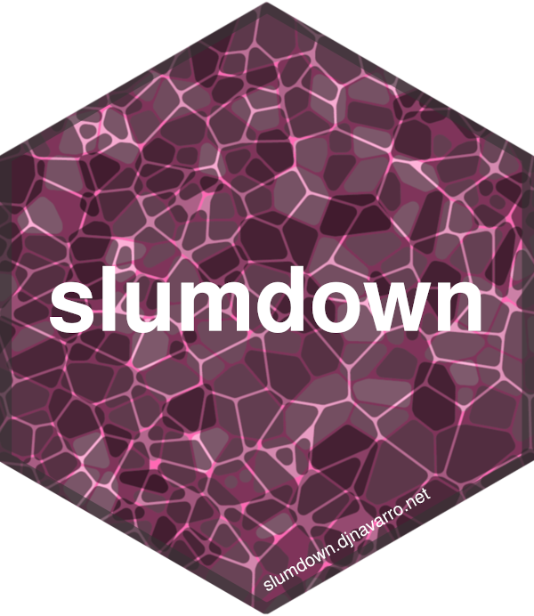

# Slumdown

### A Hugo theme and R package by [Danielle Navarro](https://twitter.com/djnavarro)



<br>

The goal of slumdown is to allow R users to create simple, lightweight websites powered by the [Hugo](https://gohugo.io) framework. It is designed to be compatible with [hugodown](https://hugodown.r-lib.org/) as well as [blogdown](https://bookdown.org/yihui/blogdown/). Additionally, it plays nicely with [thematic](https://rstudio.github.io/thematic/), allowing users to generate graphics that match the visual style of the blog. 

There are two components to slumdown, a [Hugo theme](https://github.com/djnavarro/hugo-slum) and the [slumdown package](https://github.com/djnavarro/slumdown). For most users, the only thing you need to install is the package...

```{r, eval=FALSE}
remotes::install_github("djnavarro/slumdown")
```

... and then follow the tutorial in the [posts](/post/) section of this blog.

The slum theme is an adaptation Yihue Xie's Xmin theme that borrows stylistic elements from the Tufte R Markdown theme and from the academic Hugo theme. Originally it was intended to be extremely minimal, with the modest goal of trying to make sure I understood the logic of how Hugo generates static sites. The more I played with it though, the more I enjoyed it. Eventually I discovered I had a useful little tool on my hands. So I decided to call the Hugo theme *slum*, a "somewhat light, usefully minimal" website generator.
